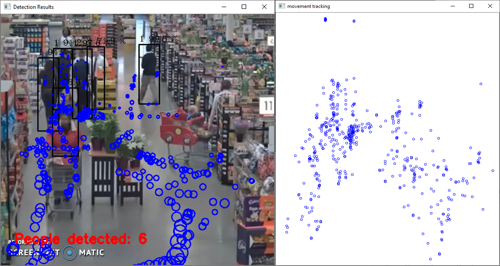

# People Analytics Object Detection using NCS2 and Raspberry Pi 

## Requirements

ensure the openvino toolkit is installed, as is python <3.6. 
For MOVIDIUS flag need an NCS2 attached to the Pi or the PC

## May Need to set up the system variables to set the path variables

cd ~\IntelSWTools\openvino\bin (or whereever openvino is installed on whichever device)
setupvars.bat 

## Run 

cd Users\jack\Documents\openvino\final_project
py object_detection_demo_ssd_async.py -m person-detection-retail-0013.xml -i CAM -d MOVIDIUS
py people_object_detection_draw_on_frame.py -m person-detection-retail-0013.xml -i CAM -d MOVIDIUS
py people_object_detection_people_trackingc.py -m person-detection-retail-0013.xml -i CAM -d MOVIDIUS

-i controls the input, there are sample vidoes included -i retail1.mp3 and -d CPU is an optional also to control the device

-m is the model, in this case an object detecttion model that came with the open vino toolkit 

## Files 

**people_object_detection_draw_on_frames.py** - this file draws the data being inferred from the model on some frames which are in turn displayed to the user. 

It also rtecords overcrowding alerts (an earlier iteration of the project) where the number of people exceeds a threshold.

**people_object_detection_people_tracking.py -** this file records in a PSQL database the number of people in the frame every 100 frames. 

**object_detection_demo_ssd_async.py** - this is the original file provided with the openvino toolkit which was adapted

## Screenshot 

this is what 'draw on frames' file returns. 

